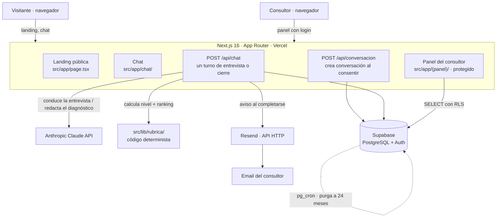

# Arquitectura

**Estado del documento:** Borrador para validar (v1)
**Última actualización:** 2026-09-06
**Acompaña a:** `docs/prd.md` (qué se construye) · `docs/data-model.md` (tablas) ·
`docs/user-flows.md` (recorridos con estado)

---

## 1. Propósito y alcance

Este documento describe **sobre qué** se construye la v1: componentes, stack, cómo fluye una
encuesta en tiempo de ejecución, dónde vive cada dato y qué decisiones técnicas se toman y por qué.

El repo es un **clon** del stack de `landing-agente-financiero`. Gran parte de la infraestructura
(bucle de turnos, persistencia por token, límite por IP, aviso por email) se reaprovecha; la lógica
de dominio (guion de entrevista, rúbrica, diagnóstico) se reescribe. `PENDIENTE-CLON.md` detalla la
frontera. Cuando este documento y ese estén de acuerdo y `docs/` esté montado, `PENDIENTE-CLON.md`
se borra.

## 2. Componentes



- **Landing pública** (`src/app/page.tsx` + `src/components/landing/`): explica qué es y lleva al
  chat. Sin cuentas.
- **Chat** (`src/app/chat/` + `src/components/chat/`): pantalla de consentimiento, ventana de
  conversación, formulario de contacto de cierre, render del diagnóstico.
- **Panel del consultor** (`src/app/(panel)/`): ruta protegida por Supabase Auth. Lista de
  encuestas completadas y detalle de cada una.
- **`POST /api/conversacion`**: crea la fila de `conversaciones` al aceptar el consentimiento.
  Antes de esa llamada no existe ningún dato personal.
- **`POST /api/chat`**: procesa un turno. Sin estado en servidor: el cliente manda el historial
  completo cada vez. Si el turno es el de cierre, calcula la rúbrica, pide el diagnóstico a Claude,
  persiste y dispara el aviso.
- **`src/lib/rubrica/`**: código determinista y testeado. Convierte las respuestas en un nivel de
  preparación para IA y un ranking de casos de uso. **Claude no calcula esto.**
- **Supabase**: PostgreSQL (datos) + Auth (login del consultor). Todo acceso de escritura pasa por
  `/api` con la clave de servicio; el navegador nunca habla directamente con la base de datos.
- **Resend**: envío del email de aviso, por `fetch` directo a su API HTTP.

## 3. Stack y justificación

| Pieza | Elección | Por qué |
|-------|----------|---------|
| Framework | Next.js 16 (App Router) | Heredado y funcionando. SSR para la landing, rutas de API en el mismo despliegue, un solo repo. |
| Lenguaje | TypeScript estricto | Convención del proyecto. Sin `any`. |
| Base de datos | Supabase (PostgreSQL) | Heredado. Postgres gestionado + Auth + RLS + `pg_cron` sin montar infraestructura. |
| Auth del consultor | Supabase Auth + lista blanca en tabla | Un solo usuario; dar de alta a mano es suficiente y evita un panel de gestión de usuarios. |
| IA conversacional | Anthropic Claude API (`claude-sonnet-5`) | Heredado. Calidad suficiente para conducir la entrevista y redactar; coste acotado por tope de turnos. |
| Estilos | Tailwind CSS v4 | Heredado. |
| Email | Resend, API HTTP directa | Heredado y con test. Sin SDK ni Edge Function que desplegar: una llamada `fetch` desde `/api/chat`. |
| Despliegue | Vercel | Heredado. Integración directa con Next.js; `x-forwarded-for` fiable para el límite por IP. |
| Gestor de paquetes | pnpm v11 | Convención del proyecto. No `npm` ni `yarn`. |

Cambiar cualquiera de estas piezas se documenta aquí con su motivo antes de tocar código.

## 4. Estructura de carpetas (planeada)

`src/` viene del clon. Lo que cambia respecto al clon va marcado.

```
src/
  app/
    layout.tsx, page.tsx          landing
    chat/page.tsx                 recorrido del visitante
    (panel)/                      NUEVO · rutas del consultor, protegidas por Supabase Auth
      layout.tsx                  comprueba sesión + es_consultor()
      encuestas/page.tsx          listado
      encuestas/[id]/page.tsx     detalle: respuestas + contacto + diagnóstico
    api/
      conversacion/route.ts       crea la conversación al consentir
      chat/route.ts               un turno; en el cierre orquesta rúbrica + diagnóstico + persistencia + aviso
  components/
    landing/                      hero, cómo funciona, protección de datos, footer
    chat/                         consent-screen, chat-window, chat-bubble, formulario de contacto, markdown-lite
    panel/                        NUEVO · tabla de encuestas, ficha de detalle
  lib/
    claude/                       cliente Anthropic; system prompts; redacción del diagnóstico
    rubrica/                      NUEVO (sustituye a lib/motor/) · cálculo determinista del resultado
    supabase/                     cliente de servicio; capa de persistencia; cliente de navegador para el panel
    email/                        aviso al consultor (Resend)
    ip.ts                         hash de IP + umbrales del límite de uso
supabase/
  migrations/                     001 se reescribe (esquema nuevo); ver docs/data-model.md
scripts/
  verificar-cobertura.mjs         cobertura de tests declarados en las fichas (corre en CI)
  verificar-persistencia.mjs      ejercita la capa de persistencia contra PGlite
```

### Renombrados respecto al clon

Para que el código hable el vocabulario del PRD (glosario §12):

- `src/lib/motor/` → **`src/lib/rubrica/`**. El contenido se reescribe entero (era cálculo
  financiero: Monte Carlo, carteras).
- `asesor` → **`consultor`** en todo: función `es_asesor()` → `es_consultor()`, tabla `asesores` →
  `consultores`, tabla `notificaciones_asesor` → `notificaciones_consultor`, módulo
  `email/aviso-asesor.ts` → `email/aviso-consultor.ts`, variable `ADVISOR_NOTIFICATION_EMAIL` →
  `CONSULTOR_NOTIFICATION_EMAIL`.
- `informes` (registro técnico) → **`resultados_rubrica`**; `planes` (lo que ve el visitante) →
  **`diagnosticos`**. Detalle en `docs/data-model.md`.

## 5. Flujo de una encuesta (runtime)

El detalle con estados y casos de error va en `docs/user-flows.md`. Resumen:

1. **Landing → chat.** El visitante pulsa el CTA.
2. **Consentimiento.** `ConsentScreen`. Al aceptar → `POST /api/conversacion`, que comprueba el
   límite por IP y crea `conversaciones` con `consentimiento_en = now()`. Devuelve un `token` (UUID
   opaco). El cliente lo guarda para el resto de la sesión.
3. **Turnos de entrevista.** Cada mensaje del visitante → `POST /api/chat` con `{ token, messages }`
   (historial completo). El servidor valida el token, comprueba el límite por IP, llama a Claude
   con el system prompt de entrevista (guion + instrucciones) y devuelve **una sola pregunta**.
   Incrementa `turnos_totales`. Tope duro de seguridad: `MAX_MENSAJES` (muy por encima del largo
   previsto del guion).
4. **Cierre.** Cuando Claude ha cubierto los ocho bloques del guion, emite en su respuesta un
   bloque estructurado de respuestas (la "ficha"). `/api/chat` lo detecta (`contieneFicha`), lo
   parsea a campos tipados con etiqueta `confirmado | estimado | pendiente` por campo
   (`parsearRespuestas`), y **no** se lo muestra en crudo al visitante.
5. **Contacto obligatorio.** Antes de mostrar nada, el chat pide nombre, email, teléfono y empresa.
   Sin los cuatro válidos, no hay diagnóstico (`M-08`).
6. **Rúbrica.** `src/lib/rubrica/` toma las respuestas parseadas y calcula, de forma determinista:
   el **nivel de preparación para IA** y el **ranking de casos de uso** por impacto × viabilidad.
   Si faltan respuestas que la rúbrica necesita, marca el resultado como incompleto y **no imputa
   valores por defecto en silencio** (`M-07`).
7. **Diagnóstico.** Segundo prompt a Claude: recibe el resultado de la rúbrica **ya calculado** como
   datos de entrada y redacta el texto narrativo, citando el mismo nivel y los mismos casos de uso.
   No recalcula nada (`M-06`). Se le añade la nota fija de "orientación preliminar, no vinculante"
   (`M-13`).
8. **Persistencia.** `persistirCierre` escribe, encadenado por el token: contacto → respuestas →
   resultado de rúbrica → diagnóstico, y marca la conversación como `completada`.
9. **Aviso.** `/api/chat` dispara el email al consultor (Resend) con el resumen del lead. Un fallo
   de envío se registra como `fallido` y **no** bloquea la respuesta al visitante (`M-10`, `RNF-07`).
10. **Panel.** El consultor entra con login y ve la encuesta en su listado.

## 6. "Claude conduce, no calcula"

Regla estructural del proyecto (CLAUDE.md → "Qué NO hacer"). Cómo se materializa:

- **Entrevista (prompt 1).** System prompt = `instrucciones-sistema.md` + `guion-entrevista.md`
  (raíz del repo), concatenados por `cargarSystemPromptEntrevista()`. Claude decide la siguiente
  pregunta y, al terminar, emite la ficha de respuestas. **No** puntúa ni ordena casos de uso.
- **Normalización, no invención.** El bloque de ficha que emite Claude es transcripción
  estructurada de lo que el visitante dijo, con una etiqueta de fiabilidad por campo. Si un dato no
  se dio, el campo va como `pendiente` — nunca se rellena con una suposición (`M-07`).
- **Rúbrica (determinista).** `src/lib/rubrica/` es la única fuente del nivel de preparación y del
  ranking. Entrada: respuestas parseadas. Salida: objeto tipado con el nivel, las puntuaciones y el
  orden. Test unitario fija que la misma entrada da siempre la misma salida (`M-05`). Lleva
  `version_rubrica` para poder reproducir un resultado antiguo si las reglas cambian.
- **Diagnóstico (prompt 2).** `src/lib/claude/` — recibe el objeto de la rúbrica y redacta. El
  prompt le prohíbe explícitamente recalcular o aproximar cifras. Salida: markdown listo para el
  chat.

Los dos prompts leen sus instrucciones de archivos `.md` de la raíz con `readFileSync` en tiempo
de ejecución (runtime `nodejs`, no Edge). **Rutas escritas en literal**, nunca por variable: con
una ruta dinámica el trazador de Next.js no sabe qué archivos empaquetar y mete el proyecto entero
en el despliegue (§9).

> **Bloqueo heredado:** esos archivos (`instrucciones-sistema.md`, `instrucciones-motor.md`) se
> borraron al clonar por ser financieros. `pnpm build` y `tsc` pasan (la lectura es en runtime),
> pero un turno real de `/api/chat` falla hasta que se escriban el guion nuevo y las instrucciones
> de la rúbrica y se reapunten esos `readFileSync`.

## 7. Persistencia

- **Cliente de servicio.** `src/lib/supabase/server.ts` crea el cliente con
  `SUPABASE_SERVICE_ROLE_KEY` (sin prefijo `NEXT_PUBLIC_`). Salta RLS. Solo en código de servidor.
- **Todo pasa por `/api`.** Ningún visitante habla con Supabase. Las tablas solo tienen policies de
  `SELECT`, y solo para quien está en la tabla `consultores` (`es_consultor()`). No hay policy de
  `INSERT/UPDATE/DELETE` para `anon` ni `authenticated`: todas las escrituras vienen del backend.
- **Encadenado por token.** El `token` de `conversaciones` enlaza todas las filas de una misma
  encuesta. Es un secreto de sesión efímero, no una URL personalizada por destinatario.
- **Capa única de mapeo.** `src/lib/supabase/persistencia.ts` concentra todo el SQL y el mapeo
  camelCase ↔ snake_case. `app/api/` no lleva SQL disperso. `scripts/verificar-persistencia.mjs`
  ejercita esas mismas funciones contra un Postgres real (PGlite).
- **Sin transacción SQL** (decisión heredada, riesgo asumido para el MVP). Las escrituras del
  cierre van como inserts secuenciales; si una falla a mitad, puede quedar una fila huérfana. Se
  detecta por `console.error` en la ruta, no hay compensación automática. **A revisar** cuando haya
  volumen real (candidato a `mejoras/`).
- **Retención a 24 meses (`M-14`).** Un job de `pg_cron` en Supabase borra periódicamente las
  `conversaciones` con `iniciada_en` de más de 24 meses y, en cascada, sus filas dependientes. El
  plazo se nombra en el texto de consentimiento. Alternativa considerada y descartada para la v1:
  Vercel Cron contra una ruta de API (añade un secreto y una ruta que proteger, sin ganar nada).

## 8. Autenticación

- **Visitante:** sin cuentas. Lo único que autoriza a `/api/chat` a escribir en una conversación
  concreta es el `token`. Sin token válido → 401 con mensaje genérico (no revela si no existe, si
  expiró o si ya se cerró).
- **Consultor:** Supabase Auth (email/enlace mágico o contraseña). **Tener cuenta no basta**: el
  permiso es estar en la tabla `consultores` (`id` referencia `auth.users`). `es_consultor()`
  (`security definer`, `search_path` fijo) es lo que evalúan todas las policies de `SELECT`. El
  layout de `(panel)/` comprueba sesión + pertenencia antes de renderizar; sin ambas, redirige al
  login sin exponer datos.
- Alta de consultores: manual, insertando la fila en `consultores`. No hay pantalla de registro.

## 9. Trampas conocidas del stack

Heredadas y verificadas en el proyecto de origen; siguen aplicando:

- **`readFileSync` con ruta literal.** Ver §6. Ruta por variable → Next.js empaqueta el repo
  entero.
- **Runtime `nodejs` en las rutas de API.** `export const runtime = "nodejs"` en
  `/api/chat` y `/api/conversacion`: necesitan `fs` y variables de entorno de servidor; Edge no
  sirve.
- **`thinking: { type: "disabled" }` en las dos llamadas a Claude.** El razonamiento extendido
  consume del mismo presupuesto de `max_tokens` que la respuesta visible; con él activado, un
  diagnóstico largo sale vacío o cortado. Conducir un turno y traducir cifras ya calculadas no lo
  necesitan.
- **`supabase/functions` excluido de `tsconfig.json`.** (Del clon; en la v1 no hay Edge Functions
  salvo que cambie la decisión de email.)
- **Next.js 16 tiene cambios de API.** Leer `node_modules/next/dist/docs/` antes de escribir
  código de framework (aviso del bloque autogenerado de `next dev`).

## 10. Configuración y secretos

Variables en `.env.local` (nunca commiteado); `.env.example` lleva las mismas con valor vacío.

| Variable | Para qué |
|----------|----------|
| `NEXT_PUBLIC_SUPABASE_URL` | Cliente Supabase (servidor y navegador). |
| `NEXT_PUBLIC_SUPABASE_ANON_KEY` | Cliente de navegador del panel (login). |
| `SUPABASE_SERVICE_ROLE_KEY` | Cliente de servidor. Salta RLS. Nunca al navegador. |
| `ANTHROPIC_API_KEY` | Llamadas a Claude. |
| `RESEND_API_KEY` | Envío del aviso. |
| `CONSULTOR_NOTIFICATION_EMAIL` | Destinatario del aviso (antes `ADVISOR_NOTIFICATION_EMAIL`). |
| `IP_HASH_PEPPER` | Secreto del HMAC-SHA256 sobre la IP. `openssl rand -hex 32`. |
| `NEXT_PUBLIC_APP_URL` | Enlaces absolutos (email, metadatos). |

Ninguna clave real se escribe en `.mcp.json` (se commitea): va `${VARIABLE}` y el valor en
`.env.local` o el entorno del shell.

## 11. Despliegue

- **Vercel** para la app. El botón lo pulsa el usuario (límite de ejecución 2 del proyecto): el
  agente prepara y explica, no despliega.
- **Supabase**: proyecto nuevo, propio de este repo. `supabase link` rellena `project_id` en
  `supabase/config.toml`. Migraciones en `supabase/migrations/`. **Nunca** apuntar nada de este
  repo al proyecto de la asesoría.
- CI: `.github/workflows/cobertura.yml` corre `verificar-cobertura.mjs` en cada PR. Falla hasta que
  `docs/prd.md` y las fichas de `docs/features/` existan (ya existe el PRD; faltan fichas).

## 12. MCPs del proyecto

Configurados el 2026-09-06 según el "Protocolo de MCPs" del CLAUDE.md. Fuentes oficiales:
[Supabase](https://supabase.com/docs/guides/getting-started/mcp),
[Resend](https://resend.com/docs/mcp-server).

| Servidor | Alcance | Transporte | Para qué | Credenciales |
|----------|---------|-----------|----------|--------------|
| `supabase` | `project` (`.mcp.json`) | HTTP remoto, `https://mcp.supabase.com/mcp?read_only=true` | Inspeccionar el esquema, preparar y revisar migraciones, consultar datos en desarrollo. | OAuth: `/mcp` → `supabase` → Authenticate. Ninguna clave en el repo. |
| `resend` | `local` (fuera del repo) | stdio, `npx -y resend-mcp` | Verificar el dominio de envío y revisar logs de entrega. | `RESEND_API_KEY` en el entorno del shell / `.env.local`. |

Notas:

- **`supabase` no opera hasta que exista el proyecto Supabase de este repo.** Cuando se cree y se
  enlace (`supabase link`), añadir `&project_ref=<ref>` a la URL para acotar el servidor a ese
  proyecto. `read_only=true` se quita puntualmente para aplicar una migración y se vuelve a poner.
- **`resend` es de alcance `local`**: vive en `~/.claude.json` bajo la ruta del proyecto, no en
  `.mcp.json`. No lo hereda nadie más. Comando de alta:
  `claude mcp add --scope local resend -- npx -y resend-mcp --key "$RESEND_API_KEY"`.
- **Vercel**: descartado. Desplegar no es tarea del agente (límite de ejecución 2); el resto de lo
  que ofrece su MCP no compensa. Revisable si aparece la necesidad.
- Los servidores de alcance `project` piden aprobación la primera vez que se abre el repo.

## 13. Decisiones heredadas a revisar

- **Sin transacción SQL en el cierre** (§7). Riesgo asumido para el MVP.
- **Renombrados `asesor`→`consultor`, `motor`→`rubrica`, `informes`/`planes`** (§4). Trabajo
  mecánico pero cruza esquema, persistencia y variables de entorno; se hace de una vez en la
  primera feature de implementación, no a trozos.
- **`from` del email** en `aviso-consultor.ts` apunta a `onboarding@resend.dev` con el nombre de la
  app antigua. Hay que poner un remitente propio y verificar el dominio en Resend.
- **Umbrales del límite por IP** (`UMBRAL_CREAR_CONVERSACION = 10`, `UMBRAL_ENVIAR_MENSAJE = 150`,
  ventana 24 h) vienen del clon. Revisar contra el volumen y el largo del guion nuevo.
- **Modelo `claude-sonnet-5` para ambos prompts.** Confirmar coste por encuesta en
  `docs/business.md`.
