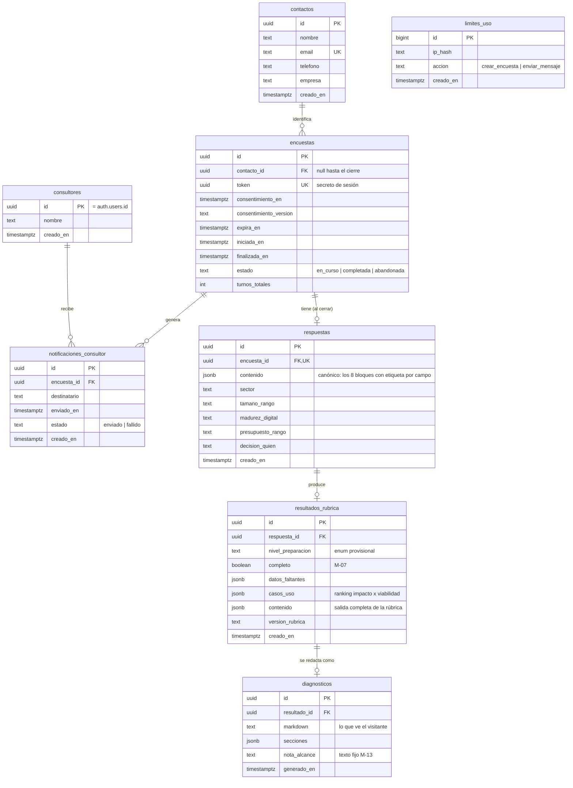

# Modelo de datos

**Estado del documento:** Borrador para validar (v1)
**Última actualización:** 2026-09-06
**Traducción ejecutable:** `supabase/migrations/` (se reescribe la `001`; ver §9)
**Acompaña a:** `docs/architecture.md` · `docs/prd.md`

---

## 1. Alcance

Este documento describe las tablas de la v1, sus relaciones, los tipos enumerados, las políticas de
acceso y la retención. Es la fuente de criterio; la migración SQL es su traducción, no una fuente
nueva.

El esquema hereda la **forma** del clon (sesión por token, dato con etiqueta de fiabilidad,
resultado interno + entrega al visitante, log de avisos, límite por IP) y cambia el **contenido de
dominio**: donde el clon tenía ~30 columnas financieras, aquí hay respuestas de una encuesta de
negocio y un resultado de rúbrica de preparación para IA.

## 2. Vista de conjunto

`limites_uso` no tiene relación con el resto: es una tabla de contadores por hash de IP, no de
dominio.

## 3. Tipos enumerados

- **`dato_estado`** — `confirmado | estimado | pendiente`. Heredado. Calidad de cada respuesta de
  la encuesta. `pendiente` significa que el visitante no dio el dato: nunca se rellena con una
  suposición (`M-07`). Vive dentro de `respuestas.contenido`, no como columna suelta (§4).
- **`encuesta_estado`** — `en_curso | completada | abandonada`. (En el clon era un `check`, no un
  enum; se mantiene como `check` para poder añadir estados sin migración de tipo.)
- **`nivel_preparacion`** — **provisional**, se fija al diseñar la rúbrica: `sin_preparar |
  inicial | en_desarrollo | consolidada`. Salida principal de la rúbrica.
- **`limite_accion`** — `crear_encuesta | enviar_mensaje`. (Renombrado desde
  `crear_conversacion`.)

Los rangos de texto libre acotado (`sector`, `tamano_rango`, `madurez_digital`,
`presupuesto_rango`, `decision_quien`) **no** se modelan como enum en la v1: su lista de valores
sale del guion de la entrevista, que todavía no está escrito. Se guardan como `text` con la lista
de valores esperada documentada aquí y validada en `src/lib/rubrica/`. Se promueven a enum cuando
el guion los congele.

## 4. Tablas

### `consultores`

Lista blanca de quién puede entrar al panel (`M-11`). **Estar en esta tabla ES el permiso** — no
basta con tener una cuenta de Supabase Auth válida.

| Columna | Tipo | Notas |
|---------|------|-------|
| `id` | `uuid` PK | Referencia `auth.users(id)`. |
| `nombre` | `text not null` | |
| `creado_en` | `timestamptz not null default now()` | |

Alta manual (un `insert`). No hay pantalla de registro. En la v1 habrá una sola fila (tú).

### `contactos`

Datos de contacto del lead. Se crea **solo al cerrar la encuesta**, cuando el visitante da los
cuatro campos (`M-08`) — nunca antes (minimización RGPD). Email normalizado a minúsculas antes de
insertar, para enlazar a la misma persona si repite la encuesta en vez de duplicarla.

| Columna | Tipo | Notas |
|---------|------|-------|
| `id` | `uuid` PK `default gen_random_uuid()` | |
| `nombre` | `text not null` | Persona de contacto. |
| `email` | `text not null unique` | Normalizado a minúsculas. |
| `telefono` | `text not null` | Se guarda tal cual lo escribe el visitante; formato no validado en BD. |
| `empresa` | `text not null` | Nombre del negocio. |
| `creado_en` | `timestamptz not null default now()` | |

> Cambio respecto al clon: `clientes` tenía `nombre` opcional y solo `email`. Aquí los cuatro son
> `not null` porque el cierre no ocurre sin ellos.

### `encuestas`

Una fila por visitante que acepta el consentimiento y abre el chat, complete la encuesta o no.
(Era `conversaciones`.)

| Columna | Tipo | Notas |
|---------|------|-------|
| `id` | `uuid` PK `default gen_random_uuid()` | |
| `contacto_id` | `uuid references contactos(id)` | `null` hasta el cierre. Tras `estado = 'completada'` **siempre** tiene valor (invariante de `M-08`). |
| `token` | `uuid not null unique default gen_random_uuid()` | Secreto de sesión efímero. Único que autoriza a `/api/chat` a escribir en esta encuesta. No es una URL por destinatario. |
| `consentimiento_en` | `timestamptz not null` | Hora de servidor al aceptar. `M-02`. |
| `consentimiento_version` | `text not null` | Identificador de la versión del texto de consentimiento aceptada (p. ej. `2026-09-01`). Nuevo respecto al clon: permite auditar qué aceptó cada visitante si el texto cambia. |
| `expira_en` | `timestamptz not null default (now() + interval '30 days')` | Ventana para reanudar una encuesta a medias (`S-01`). Reloj corto, distinto de la retención (§6). |
| `iniciada_en` | `timestamptz not null default now()` | Ancla de la retención a 24 meses. |
| `finalizada_en` | `timestamptz` | Se rellena al completar. |
| `estado` | `text not null default 'en_curso' check (estado in ('en_curso','completada','abandonada'))` | |
| `turnos_totales` | `int not null default 0` | Contador de turnos procesados. Tope duro `MAX_MENSAJES` en la ruta. |

### `respuestas`

Una fila por encuesta completada. Contiene **todas** las respuestas de los ocho bloques del guion
(`M-04`). (Era `fichas`.)

**Decisión de diseño:** el clon tenía una columna tipada por dato (~30). Aquí el guion de la
entrevista todavía no está escrito, así que congelar 30 columnas ahora garantiza migraciones cada
vez que el guion cambie. En su lugar:

- **`contenido jsonb not null`** es la fuente canónica: el objeto estructurado que produce el
  parseo de la ficha que emite Claude al cerrar, con la forma del tipo `RespuestasEncuesta` de
  `src/lib/rubrica/`. Cada campo lleva `{ valor, etiqueta }` con `etiqueta` de `dato_estado`,
  igual que el `Dato<T>` heredado.
- **Columnas promovidas**: copia desnormalizada de los pocos campos que el panel lista/filtra y que
  el análisis de negocio (`docs/business.md`) agrega. Son estables aunque cambie la redacción de
  las preguntas.

| Columna | Tipo | Notas |
|---------|------|-------|
| `id` | `uuid` PK `default gen_random_uuid()` | |
| `encuesta_id` | `uuid not null unique references encuestas(id) on delete cascade` | 1:1 con `encuestas`. |
| `contenido` | `jsonb not null` | Canónico. Los 8 bloques con etiqueta por campo. |
| `sector` | `text` | Bloque 1. Valor libre acotado (lista en el guion). |
| `tamano_rango` | `text` | Bloque 1. P. ej. `autonomo | 1-9 | 10-49 | 50+`. |
| `madurez_digital` | `text` | Bloque 5. P. ej. `baja | media | alta`. |
| `presupuesto_rango` | `text` | Bloque 7. P. ej. `sin_definir | <1k | 1k-5k | 5k-20k | >20k`. |
| `decision_quien` | `text` | Bloque 8. Quién decide (rol), en texto acotado. |
| `creado_en` | `timestamptz not null default now()` | |

Los ocho bloques del guion (`M-04`), para referencia:

1. Tamaño y sector · 2. Procesos y tareas actuales · 3. Tareas repetitivas o intensivas en datos ·
4. Herramientas y sistemas en uso · 5. Madurez digital del equipo · 6. Sensibilidad de datos y
cumplimiento · 7. Presupuesto y disposición a invertir · 8. Quién decide.

> El grupo repetible del clon (`deudas`, tabla aparte) no tiene equivalente en la v1: las listas
> variables (herramientas en uso, tareas repetitivas) viven como arrays dentro de
> `contenido`. Si alguna necesita consultarse de forma relacional más adelante, se promueve a
> tabla entonces.

### `resultados_rubrica`

Salida de `src/lib/rubrica/` — determinista, testeada, **no la calcula el modelo** (`M-05`).
Relación 1:1 con `respuestas` en esta versión; si se reprocesa la misma encuesta con reglas
nuevas, se versiona con una fila nueva. (Era `informes`.)

| Columna | Tipo | Notas |
|---------|------|-------|
| `id` | `uuid` PK `default gen_random_uuid()` | |
| `respuesta_id` | `uuid not null references respuestas(id) on delete cascade` | |
| `nivel_preparacion` | `text not null` | Valor del enum provisional `nivel_preparacion`. |
| `completo` | `boolean not null` | `false` si faltan respuestas que la rúbrica necesita (`M-07`). |
| `datos_faltantes` | `jsonb not null default '[]'::jsonb` | Lista de qué falta y para qué se necesitaba. Se muestra en el diagnóstico. |
| `casos_uso` | `jsonb not null` | Array ordenado por puntuación desc. Cada elemento: `{ nombre, descripcion, impacto (1-5), viabilidad (1-5), puntuacion, justificacion }`. |
| `contenido` | `jsonb not null` | Salida completa de la rúbrica (incluye lo anterior + señales intermedias), para auditar y para alimentar el prompt del diagnóstico. |
| `version_rubrica` | `text not null` | Trazabilidad: sin esto un resultado antiguo no se puede reproducir si las reglas cambian. |
| `creado_en` | `timestamptz not null default now()` | |

### `diagnosticos`

Lo que de verdad ve el visitante en el chat. Separado de `resultados_rubrica` a propósito: uno es
el registro técnico, el otro su traducción entregada. (Era `planes`.)

| Columna | Tipo | Notas |
|---------|------|-------|
| `id` | `uuid` PK `default gen_random_uuid()` | |
| `resultado_id` | `uuid not null references resultados_rubrica(id) on delete cascade` | |
| `markdown` | `text not null` | Texto redactado por Claude a partir del resultado ya calculado (`M-06`). |
| `secciones` | `jsonb not null` | El markdown descompuesto por encabezados `##`, mecánicamente. |
| `nota_alcance` | `text not null` | Texto fijo de "orientación preliminar, no vinculante" (`M-13`), guardado con el diagnóstico para auditar qué vio cada visitante. |
| `generado_en` | `timestamptz not null default now()` | |

### `notificaciones_consultor`

Registro del aviso automático por email (`M-10`), para confirmar envíos y depurar fallos. (Era
`notificaciones_asesor`.)

| Columna | Tipo | Notas |
|---------|------|-------|
| `id` | `uuid` PK `default gen_random_uuid()` | |
| `encuesta_id` | `uuid not null references encuestas(id) on delete cascade` | |
| `destinatario` | `text not null` | `CONSULTOR_NOTIFICATION_EMAIL` en el momento del envío. |
| `enviado_en` | `timestamptz` | `null` si el envío falló. |
| `estado` | `text not null check (estado in ('enviado','fallido'))` | Un fallo se registra, no se reintenta ni bloquea al visitante (`RNF-07`). |
| `creado_en` | `timestamptz not null default now()` | |

### `limites_uso`

Protección contra abuso. La encuesta es pública y cada turno cuesta dinero real en la API de
Claude. **Se guarda un hash de la IP (HMAC-SHA256 con `IP_HASH_PEPPER`), nunca la IP en claro.**
Sin cambios respecto al clon salvo el nombre de la acción.

| Columna | Tipo | Notas |
|---------|------|-------|
| `id` | `bigint generated always as identity` PK | |
| `ip_hash` | `text not null` | |
| `accion` | `text not null check (accion in ('crear_encuesta','enviar_mensaje'))` | |
| `creado_en` | `timestamptz not null default now()` | |
| | | Índice: `(ip_hash, creado_en)`. |

Umbrales (en `src/lib/ip.ts`, no en BD): `UMBRAL_CREAR_ENCUESTA`, `UMBRAL_ENVIAR_MENSAJE`, ventana
24 h. Heredados del clon; **a revisar** contra el largo del guion nuevo.

## 5. Políticas de acceso (RLS)

Idéntico patrón al clon. Ningún visitante habla con Supabase: **todas** las escrituras pasan por
`src/app/api/` con la clave de servicio (que no pasa por RLS). Por eso:

- RLS activado en todas las tablas.
- **Solo** policies de `SELECT`, y **solo** para `authenticated` que además cumpla `es_consultor()`
  (`security definer`, `search_path = public`, `stable`).
- Ninguna policy de `INSERT/UPDATE/DELETE` para `anon` ni `authenticated`.
- `limites_uso` no lleva ni policy de `SELECT`: ni el consultor la lee desde el cliente.

Tablas con policy de `SELECT` para consultor: `consultores`, `contactos`, `encuestas`,
`respuestas`, `resultados_rubrica`, `diagnosticos`, `notificaciones_consultor`.

## 6. Retención (`M-14`)

- **Reloj:** `encuestas.iniciada_en`. Todo lo demás cuelga de una encuesta.
- **Plazo:** 24 meses. Nombrado en el texto de consentimiento.
- **Mecanismo:** job de `pg_cron` en Supabase que borra las `encuestas` con `iniciada_en <
  now() - interval '24 months'`. Las filas dependientes caen por `on delete cascade`
  (`respuestas` → `resultados_rubrica` → `diagnosticos`; `notificaciones_consultor`).
  `contactos` no se borra en cascada: una persona puede tener varias encuestas; se purga aparte
  cuando no le queda ninguna (consulta documentada junto al job).
- **Cambio respecto al clon:** el esquema heredado usaba `references` sin `on delete cascade`.
  Aquí se añade cascada en las tablas dependientes para que el job sea una sola sentencia.
- **Limpieza de encuestas a medias:** las `en_curso` pasadas de `expira_en` se marcan
  `abandonada` (o se borran) en el mismo job. Detalle fino → `mejoras/`.

## 7. Invariantes

- Una `encuesta` en estado `completada` tiene `contacto_id`, `finalizada_en`, y exactamente una
  fila en `respuestas`, una en `resultados_rubrica` y una en `diagnosticos`.
- `respuestas.contenido` nunca tiene un campo con valor inventado: si el visitante no lo dio, va
  `etiqueta = 'pendiente'` y `valor = null`.
- Ninguna cifra de `resultados_rubrica` procede de una respuesta del modelo.
- No hay IP en claro en ninguna tabla.

## 8. Sin transacción SQL en el cierre

Heredado y asumido para el MVP. Las escrituras del cierre (`persistirCierre`) van como `insert`s
secuenciales: contacto → respuestas → resultado → diagnóstico → marcar `encuestas.estado`. Si una
falla a mitad, puede quedar una encuesta `completada` sin diagnóstico, o una fila huérfana. Se
detecta por `console.error` en la ruta; no hay compensación automática. Candidato a `mejoras/`
(envolver en RPC transaccional de Postgres) cuando haya volumen real.

## 9. Cambios respecto al esquema heredado (`001_esquema_inicial.sql`)

| Heredado | v1 | Motivo |
|----------|-----|--------|
| `asesores` | `consultores` + `es_asesor()` → `es_consultor()` | Vocabulario del PRD. |
| `clientes` (nombre opcional, solo email) | `contactos` (nombre, email, teléfono, empresa; todos `not null`) | `M-08`. |
| `conversaciones` | `encuestas` (+ `consentimiento_version`) | Vocabulario + auditoría de consentimiento. |
| `fichas` (~30 columnas financieras + enums de riesgo) | `respuestas` (`contenido` jsonb canónico + 5 columnas promovidas) | El guion no está escrito; evitar migraciones por cada ajuste. |
| `deudas` (grupo repetible) | — (arrays dentro de `contenido`) | No hay grupo repetible que necesite consulta relacional en la v1. |
| `informes` (Monte Carlo, carteras, gap…) | `resultados_rubrica` (`nivel_preparacion`, `casos_uso`, `completo`) | Dominio nuevo. |
| `planes` | `diagnosticos` | Vocabulario. |
| `notificaciones_asesor` | `notificaciones_consultor` | Vocabulario. |
| `dato_estado` enum | igual | Se reaprovecha. |
| `references` sin cascada | `on delete cascade` en dependientes | Retención con un job de una sentencia. |
| acción `crear_conversacion` | `crear_encuesta` | Vocabulario. |

## 10. Decisiones abiertas

- **`nivel_preparacion`**: los valores del enum son provisionales hasta diseñar la rúbrica (paso
  siguiente, junto con `guion-entrevista.md`).
- **Columnas promovidas de `respuestas`**: la lista (`sector`, `tamano_rango`, `madurez_digital`,
  `presupuesto_rango`, `decision_quien`) se confirma cuando el guion fije sus valores; puede
  crecer si `business.md` pide agregar por algún campo más.
- **`respuestas` como jsonb vs columnas tipadas**: si al terminar el guion resulta estable y
  acotado, se puede reconsiderar pasar a columnas tipadas antes de la primera release.
- **Enlace `contactos` ↔ `encuestas`**: 1 contacto → N encuestas por email. Si en la práctica
  molesta (misma persona, empresas distintas), se revisa.
